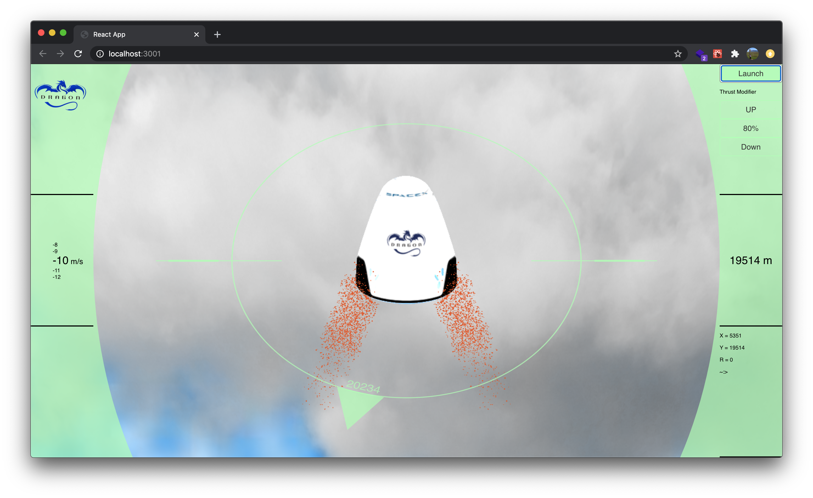

# Dragon Lander

Dragon Lander is a web based game that was hacked togeather in a weekend. It uses Three.js for 3D rendering and React + SVG graphics to overlay the UI.

### To run locally: `npm i && npm start`

# Have fun!
